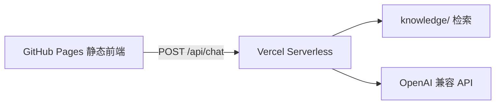

# ContentBrief Chat

面向快消**饮料**行业内容团队的企业级对话助手演示：**知识问答** + **活动 Content Brief 任务闭环**（引用溯源、追问补全、人工确认导出）。**V2** 已支持意图路由、任务状态机、跨轮 Brief 修订、会话恢复与本地指标面板（`?debug=1`）。

虚构品牌：**澄澈饮力**。文档与代码中不包含任何真实企业名称。

## 链接

| 资源 | 地址 |
|------|------|
| 在线 Demo | https://wenjunwang6205-sudo.github.io/content-brief-chat/ |
| 文档 PRD | [docs/PRD.md](./docs/PRD.md) |
| 演示脚本 | [docs/demo-scripts.md](./docs/demo-scripts.md) |

## 架构



- API Key 仅配置在 **Vercel 环境变量**，不进仓库与前端 bundle  
- 公网 **无 DEMO_TOKEN**；默认每 IP 每分钟 10 次请求  

## 文档

| 文档 | 说明 |
|------|------|
| [docs/PRD.md](./docs/PRD.md) | 产品需求 + **分阶段交付范围** |
| [docs/UI-V1-PRD.md](./docs/UI-V1-PRD.md) | **UI V1** 浅色 ChatGPT 风升级 |
| [docs/UI-V1-checklist.md](./docs/UI-V1-checklist.md) | UI V1 执行清单 |
| [docs/V2-PRD.md](./docs/V2-PRD.md) | **V2** 意图路由 · 任务状态机 · 会话恢复 · 指标 |
| [docs/V2-checklist.md](./docs/V2-checklist.md) | V2 执行清单 |
| [docs/enterprise-capability-mapping.md](./docs/enterprise-capability-mapping.md) | 企业助手能力映射与验收 |
| [docs/execution-checklist.md](./docs/execution-checklist.md) | 执行清单 |
| [docs/testing.md](./docs/testing.md) | 测试与内容质量评测 |
| [docs/prompt-iteration.md](./docs/prompt-iteration.md) | Prompt 迭代记录 |

## 本地开发

### 1. 部署 API（Vercel）

```bash
# 安装 Vercel CLI 后于仓库根目录
vercel link
vercel env add LLM_API_KEY
vercel env add LLM_BASE_URL   # 可选，默认 OpenAI
vercel env add LLM_MODEL      # 可选，默认 gpt-4o-mini
vercel deploy --prod
```

### 2. 前端 Demo

```bash
cd demo
cp .env.example .env.local
# 编辑 VITE_API_BASE=https://你的.vercel.app
npm install
npm run dev
```

### 3. 全栈本地（Vercel Dev）

```bash
vercel dev
# 另开终端
cd demo && npm run dev
# .env.local 中 VITE_API_BASE 留空，走 vite proxy → localhost:3000
```

## GitHub Pages 配置

1. 仓库 **Settings → Pages → Build and deployment**：Source 选 **GitHub Actions**  
2. 仓库 **Settings → Secrets and variables → Actions → Variables** 新增：  
   - `VITE_API_BASE` = 你的 Vercel 生产域名（无尾斜杠）  
3. push 到 `main` 后自动部署  

## 目录结构

```
content-brief-chat/
├── api/chat.js          # Vercel 入口
├── lib/                 # RAG、LLM、限流、合规
├── knowledge/           # 饮料场景知识库
├── eval/                # badcase、金标准
├── demo/                # Vite 前端
└── docs/                # PRD、测试、清单
```

## License

MIT
