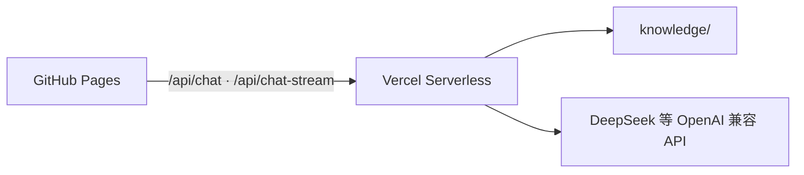

# ContentBrief Chat

面向快消**饮料**内容团队的企业级对话助手演示：**知识问答** + **活动 Content Brief 任务闭环**（引用溯源、多轮补全、流式输出、人工确认导出）。

虚构品牌：**澄澈饮力**。

| 资源 | 链接 |
|------|------|
| 在线 Demo | https://wenjunwang6205-sudo.github.io/content-brief-chat/ |
| **文档（评审入口）** | [docs/文档导航.md](./docs/文档导航.md) |

## 3 分钟演示

1. 打开 Demo → 问「品牌调性是什么？」→ 流式回答 + 点击引用 `[1]`  
2. 说「做个抖音活动」→ 补全 618 / 产品 / 目标 / 人群 → 生成 Brief  
3. 「把人群改成 Z 世代」→ 查看修订摘要 → 导出 → 标记任务完成  

详细步骤见 [docs/演示指南.md](./docs/演示指南.md)。

## 架构



API Key 仅配置在 Vercel 环境变量。公网按 IP 限流。

## 本地开发

```bash
# API
vercel link && vercel env add LLM_API_KEY
vercel dev

# 前端（另开终端）
cd demo && npm install && npm run dev
# .env.local 中 VITE_API_BASE 留空可走 proxy → localhost:3000
```

GitHub Pages：Settings → Pages → Source 选 **GitHub Actions**；Variables 设置 `VITE_API_BASE` 为 Vercel 域名。

## 质量回归

```bash
npm run eval
```

## 目录

```
content-brief-chat/
├── api/           # chat、chat-stream、citation
├── lib/           # RAG、意图、合规
├── knowledge/     # 知识库
├── demo/          # 前端
├── docs/          # 需求分析、大图、PRD（见 docs/文档导航.md）
└── eval/          # 回归用例
```

## License

MIT
