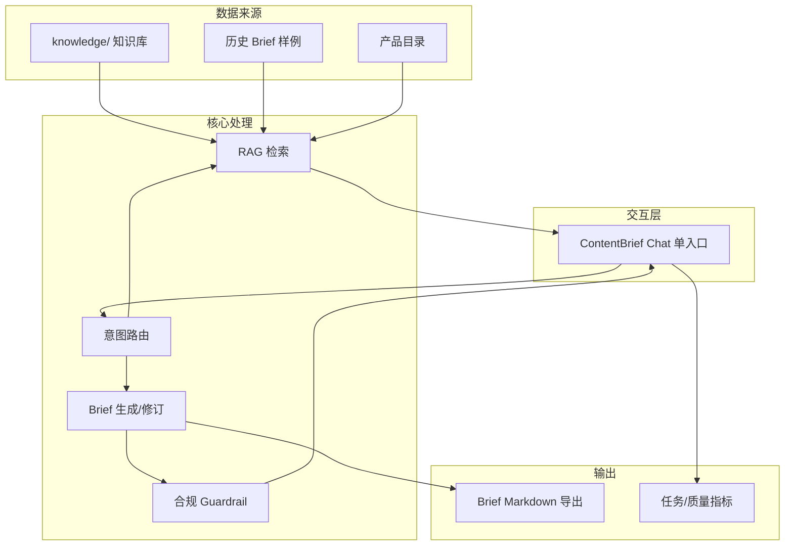

# 产品大图 — 内容团队提效系统

| 字段 | 内容 |
|------|------|
| 文档类型 | **产品大图 / 系统架构（规划层）** |
| 上游 | [需求分析](./需求分析.md) |
| 下游 | [设计过程](./设计过程.md)、[产品PRD](./产品PRD.md)（切口） |
| Demo | [ContentBrief Chat](https://wenjunwang6205-sudo.github.io/content-brief-chat/) = 图中 **★ 模块的实现** |

---

## 1. 系统定义

**内容团队提效系统（Content Team Efficiency Platform）**  
面向快消（本稿：饮料）品牌**内容中心**，覆盖「知识—策划—产出—合规—复盘」中 **策划与产出段** 的数字化、AI 辅助能力。

与 Demo 的关系：

```
┌──────────────────────────────────────────────────────────────┐
│           内容团队提效系统（规划中的完整产品）                  │
│  ┌────────┐ ┌────────┐ ┌────────┐ ┌────────┐ ┌────────┐   │
│  │知识中心│ │选题洞察│ │Brief中心│ │渠道适配│ │质量运营│   │
│  └───┬────┘ └───┬────┘ └───┬────┘ └───┬────┘ └───┬────┘   │
│      │          │          │          │          │          │
│      └──────────┴────┬─────┴──────────┴──────────┘          │
│                      ▼                                      │
│           ┌─────────────────────┐                             │
│           │ 统一对话工作台 ★   │  ← ContentBrief Chat Demo   │
│           │ (意图路由+任务FSM) │                             │
│           └─────────────────────┘                             │
└──────────────────────────────────────────────────────────────┘
```

---

## 2. 模块大图

### 2.1 能力地图

| 模块 | 能力说明 | 用户价值 | V0 | V1+ |
|------|----------|----------|-----|-----|
| **M1 知识中心** | 品牌/产品/渠道/合规统一语料；RAG；引用 | 少翻文档、口径一致 | ★ Demo | 向量库、权限分级 |
| **M2 选题洞察** | 季节/竞品/历史活动参考 | 策划有依据 | 口述 | 数据中台对接 |
| **M3 Brief 中心** | 模板、补槽、生成、修订、导出 | 首稿提效 | ★ Demo | 审批流 |
| **M4 渠道适配** | 按平台改标题/结构/字数 | 少踩平台规则 | 部分（规范问答） | 一键多版本 |
| **M5 合规引擎** | 禁用词、价格事实、绝对化 | 降风险 | ★ Demo guard | 全链路扫描 |
| **M6 质量运营** | rubric、badcase、eval 回归 | 可迭代 | ★ 文档+脚本 | 看板 |
| **M7 对话工作台** | 单入口、意图路由、任务状态 | 一个入口办完事 | ★ Demo | SSO、工单 |

### 2.2 信息流（简化）



---

## 3. 与快消饮料业务的适配

| 快消特性 | 系统映射 |
|----------|----------|
| SKU 多、季节营销密 | 知识库 `product/` + 活动样例 `cases/` |
| 小红书/抖音/直播规则不一 | `channel/` 分平台规范 |
| 广告法与功效声称严 | `compliance/` + 拒答策略 |
| Brief 是跨部门交接物 | 7 章模板 + 导出 + 人工确认 |

---

## 4. 分期路线图

| 阶段 | 范围 | 交付形态 |
|------|------|----------|
| **V0（当前 Demo）** | M1+M3+M5+M6+M7 最小闭环 | GitHub Pages + Vercel API |
| V1 | 会话后台、简单审批、渠道改写草案 | 企业内网试点 |
| V2 | 选题数据、素材库、与飞书集成 | 部门级推广 |

---

## 5. Demo 在大图中的位置

> 「产品大图」描述的是**完整系统**；本仓库 **ContentBrief Chat** 是 **M7 对话工作台** 与 **M1/M3/M5** 的 V0 实现，用来验证切口，不是全部模块都已开发。

现场演示时建议：

1. 先展示本图（或 PRD §3 简图）— **系统观**  
2. 再打开 Demo — **切口可运行**  
3. 打开 [产品PRD](./产品PRD.md) — **详细需求与验收**  

---

## 6. 文档索引

| 文档 | 层级 |
|------|------|
| [需求分析](./需求分析.md) | 为什么做 |
| 本文 | 做什么模块 |
| [设计过程](./设计过程.md) | 怎么收敛到切口 |
| [产品PRD](./产品PRD.md) | 切口详细需求 |
